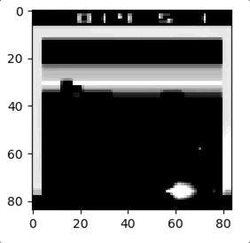

Visual-Explanation-of-Atari
==

Tensorflow Implementation of Visualizing and Understanding Atari Agents that is a novel methodology for interpreting decision of agent trained under the reinforcement learning framework.

## Reference paper
**"Visualizing and Understanding Atari Agents"**. Sam Greydanus, Anurag Koul, Jonathan Dodge and Alan Fern (https://arxiv.org/abs/1711.00138)

## Running Examples



## Environment
We will use the OpenAI Gym environment. OpenAI Gym is a toolkit for developing and comparing reinforcement learning algorithms. https://gym.openai.com/envs/#atari

## Pretrained Models
We provided pretrained models for the game of "breakout" and "pong".
These models were obtained using [this repo](https://github.com/NVlabs/GA3C) (default hyperparameters).

## How to Use

```bash
$ cd Visual-Explanation-of-Atari 
$ python main.py -m critic -e BreakoutDeterministic-v0 --first_frame 350 --num_frames 100
```

## Requirements 
+ tensorflow (1.4.0)
+ numpy (1.15.0)
+ matplotlib (2.2.2)

## License
[Apache License 2.0](https://github.com/OpenXAIProject/LRP-Time-Series/blob/master/LICENSE "Apache")

## Contacts
If you have any question, please contact Xie Qin(xieqin856@unist.ac.kr) and/or Sohee Cho(shcho@unist.ac.kr).

<br /> 
<br />

# XAI Project 

**This work was supported by Institute for Information & Communications Technology Promotion(IITP) grant funded by the Korea government(MSIT) (No.2017-0-01779, A machine learning and statistical inference framework for explainable artificial intelligence)**

+ Project Name : A machine learning and statistical inference framework for explainable artificial intelligence(의사결정 이유를 설명할 수 있는 인간 수준의 학습·추론 프레임워크 개발)

+ Managed by Ministry of Science and ICT/XAIC 

+ Participated Affiliation : UNIST, Korea Univ., Yonsei Univ., KAIST, AItrics  

+ Web Site : <http://openXai.org>